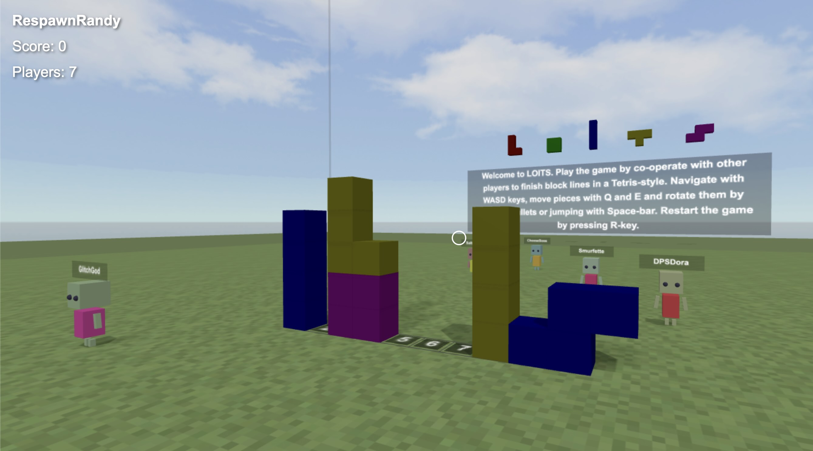

Here's the updated README with your requested changes:

# LOITS Game

[](https://loitsgame.web.app)

Welcome to LOITS, a multiplayer game where players cooperate to complete block lines in a Tetris-style gameplay. Navigate using the WASD keys, move pieces with Q and E, and rotate them by shooting bullets or jumping with the Space-bar. Restart the game by pressing the R key.

**[Try LOITS Game Now!](https://loitsgame.web.app)**

## Features

- Multiplayer functionality
- Dynamic gameplay with player interactions
- Colorful graphics and animations

## Development

This project is open for further development! Contributions are welcome - we encourage both human developers and AI collaborators to submit pull requests with improvements, new features, or optimizations. Feel free to explore and enhance the game.

## Built With

This game was built with 99% AI assistance using Cursor and the built-in AI tools.

## Getting Started

To get started with the project, clone the repository and install the necessary dependencies:

```bash
npm install
```

To run the development server:

```bash
npm run dev
```

To build the project for deployment:

```bash
npm run build
```

To deploy the project:

```bash
npm run deploy
```

Enjoy playing and developing LOITS!
